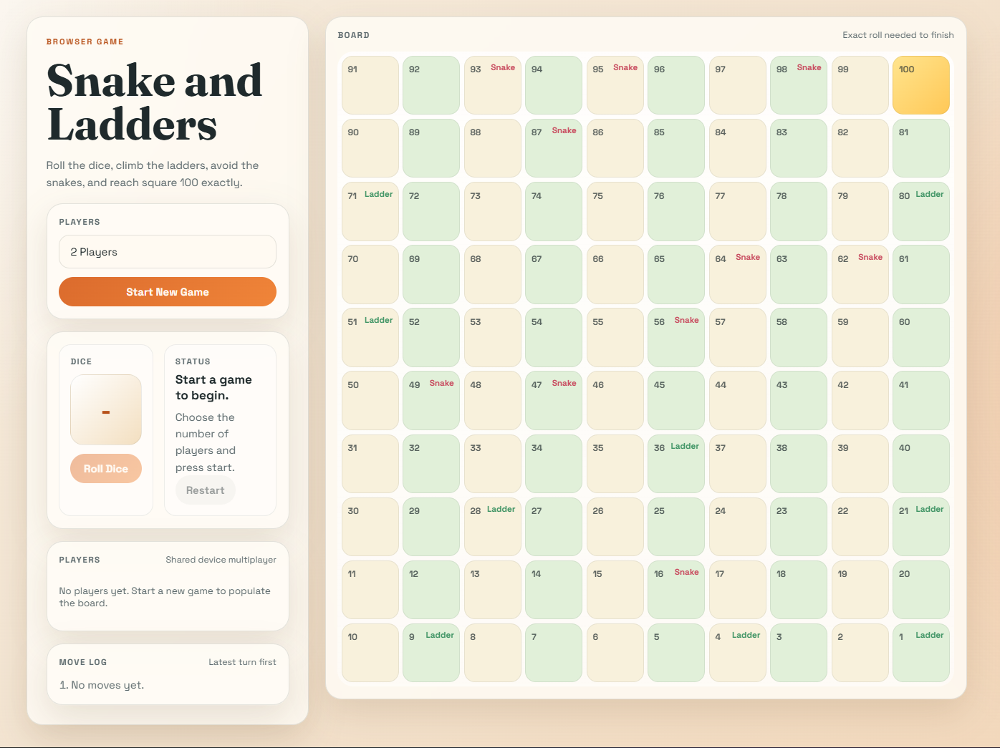

# Snake and Ladders

<p align="center">
  
</p>

<p align="center">
  A modern browser-based Snake and Ladders game built with HTML, CSS, and vanilla JavaScript.
</p>

<p align="center">
  <a href="https://github.com/Aniket886/snake-and-ladders">Repository</a> •
  <a href="#features">Features</a> •
  <a href="#rules">Rules</a> •
  <a href="#run-locally">Run Locally</a>
</p>

## Overview

This project recreates the classic Snake and Ladders board game with a cleaner interface and shared-device multiplayer. The board is generated in JavaScript, the player turns are tracked live, and the layout is responsive enough to work on both desktop and mobile screens.

## Features

- 2 to 4 player local multiplayer
- Exact roll required to finish on square 100
- Generated 10x10 board with snake and ladder markers
- Live dice result, turn indicator, and move log
- Restart flow without reloading the page
- Responsive layout with a styled control panel and board

## Rules

1. Select the number of players and start a new game.
2. Players take turns rolling the dice.
3. Landing on a ladder moves the player up.
4. Landing on a snake moves the player down.
5. A player must roll the exact number needed to reach square 100.
6. If the roll overshoots 100, the token stays in place.

## Tech Stack

- HTML5
- CSS3
- Vanilla JavaScript
- Google Fonts

## Board Layout

### Snakes

- 16 to 6
- 47 to 26
- 49 to 11
- 56 to 53
- 62 to 19
- 64 to 60
- 87 to 24
- 93 to 73
- 95 to 75
- 98 to 78

### Ladders

- 1 to 38
- 4 to 14
- 9 to 31
- 21 to 42
- 28 to 84
- 36 to 44
- 51 to 67
- 71 to 91
- 80 to 100

## Project Structure

```text
Snake n Ladders/
├── index.html
├── styles.css
├── script.js
├── ss1.png
└── README.md
```

## Run Locally

```bash
git clone https://github.com/Aniket886/snake-and-ladders.git
cd snake-and-ladders
```

Open `index.html` in a browser, or launch the folder with a simple local server such as VS Code Live Server.

## Future Improvements

- Add custom player names
- Add dice roll animation
- Add sound effects toggle
- Add a single-player mode
- Draw visual snake and ladder paths on the board

## Author

Built as a front-end game project using standard web technologies.
